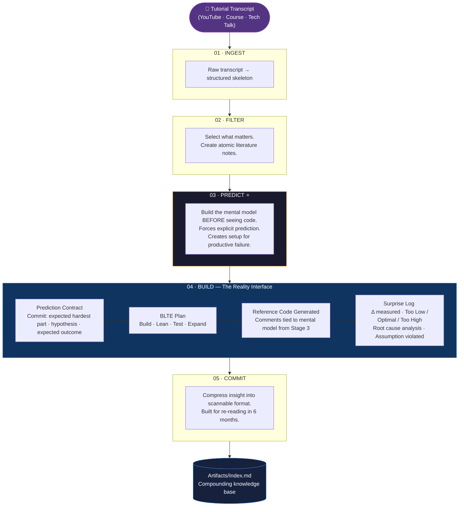
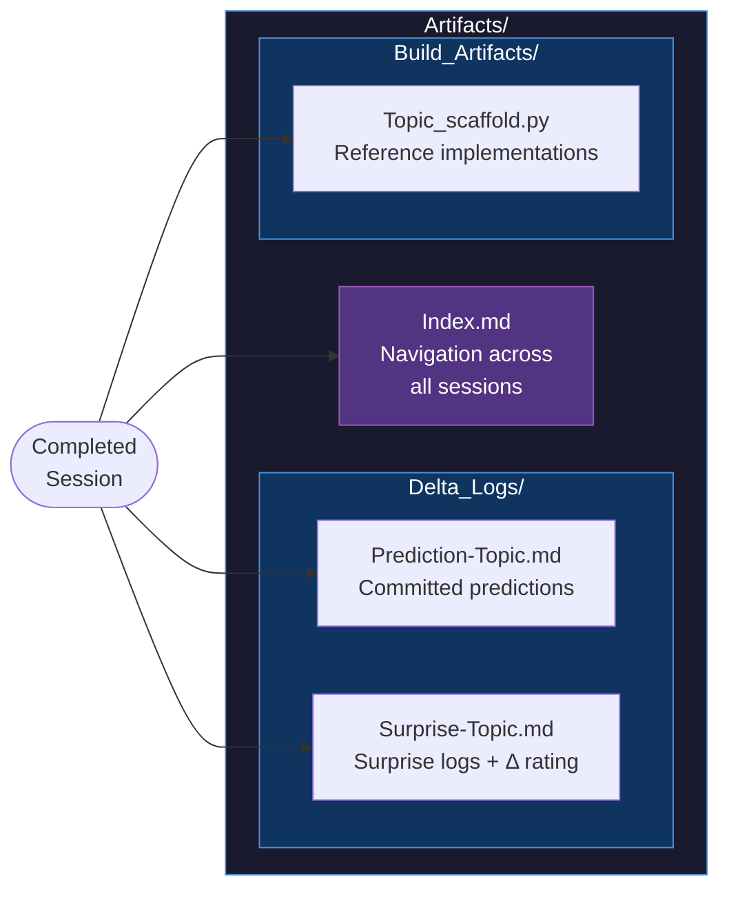

# SweAIT

## Software Engineering AI Thinking

*Pronounced "sweet"*

> Most LLM learning tools make you feel productive while keeping you passive.  
> SweAIT is built on a different premise: **surprise is the signal. Struggle is the method.**


## The Problem with Tutorial-Driven Learning

You watch a 3-hour course. You follow along. The code works.  
Two weeks later, you can't reproduce it without the video.

This isn't a motivation problem. It's a cognitive architecture problem.

Passive consumption — even with an LLM summarising and explaining — doesn't create durable knowledge. It creates **the illusion of understanding.** The information entered your working memory. It never made it to long-term storage because nothing forced your brain to *predict*, *fail*, and *update.*

SweAIT fixes this at the system level.


## The Core Insight

Learning happens at the moment of **prediction error** — when what you expected to happen collides with what actually happened.

Too little surprise (Δ): no update. You already knew this.  
Too much surprise (Δ): overload. The gap is too large to bridge.  
**Optimal Δ**: a specific, clarifying surprise. This is where the mental model actually rewires.

SweAIT's job is to generate optimal Δ — and regulate it — throughout your learning session.


## How It Works: The 5-Stage Pipeline

Input is a tutorial transcript — a YouTube video, a course chapter, a technical talk. Something a working engineer would want to digest quickly but actually retain.




## Stage 4 in Detail: The Reality Interface

This is the engine. Everything else serves this stage.

### The Prediction Contract (mandatory before any code)

Before Stage 4 generates a single line of code, you must commit to three statements:

```
1. Prediction:       "I expect the hardest part to be [X] because [Y]."
2. Hypothesis:       "I believe we can skip [Z] because it's not core."
3. Expected outcome: "When I run this, I expect [Behavior]."
```

These are saved to `Artifacts/Delta_Logs/Prediction-[Topic].md`.

This step is not optional. Without a committed prediction, there is no prediction error. Without prediction error, there is no learning — only the illusion of it.

### The BLTE Plan

Before building, a strategy is declared:

- **B**uild — the absolute minimum to prove the concept
- **L**ean — what is deliberately excluded and why
- **T**est — what running this will verify
- **E**xpand — what comes next, once the core is proven

### The Build

The working reference code is generated with comments tied explicitly to the mental model from Stage 3. The code isn't the goal. The collision between your prediction and the code's behaviour is the goal.

### The Surprise Log (mandatory after running)

```markdown
## Surprise Log: [Topic]

### What Actually Happened?
[User fills this]

### Δ Classification
- [ ] Too Low   — No surprise. Everything worked as expected.
- [ ] Optimal   — Specific, clarifying surprise. Mental model updated.
- [ ] Too High  — Confusing. Overwhelming. Gap too large.

### Root Cause Analysis
Was my prediction wrong because of:
- [ ] Mental model failure (conceptual misunderstanding)
- [ ] Syntax/tooling error (mechanical mistake)

### What assumption was violated?
[User fills this]
```

### The Regulation Rule

If you report **Optimal Δ** — do not ask for the explanation. You will not get it.

SweAIT will provide hints. It will not fix the code. It will not explain the solution.  
Struggle is not a bug in the learning process. It is the learning process.

Only if Δ becomes **Too High** — genuinely overwhelming, not just uncomfortable — does SweAIT intervene directly.


## The Artifacts Layer (Your Compounding Knowledge Base)

Every completed session deposits into `Artifacts/`:



`Index.md` is the persistent, compounding layer. Unlike RAG systems that re-derive context on every query, this index accumulates over time. Every session makes every future session richer.


## How SweAIT Relates to the Karpathy LLM Wiki Pattern

Andrej Karpathy's LLM Wiki pattern proposes building a persistent markdown knowledge base that an LLM maintains and reasons over — instead of re-deriving answers from raw documents on every query. The insight: **knowledge should compound, not reset.**

SweAIT's `Artifacts/Index.md` implements this pattern.

The difference is what happens *before* the knowledge reaches the index.

Karpathy's wiki: raw input → LLM compiles → wiki entry. Knowledge accumulates.  
SweAIT: raw input → 5-stage pipeline with mandatory prediction and surprise logging → wiki entry. Knowledge is *earned*.

The compounding artifact is the same. The path to it is engineered for retention, not just storage.

> Biggest absence is feedback loop!


## Who This Is For

Working engineers who:
- Learn from tutorials but can't reproduce what they learned two weeks later
- Have limited time and can't afford passive consumption that doesn't stick
- Want to build genuine intuition, not just familiarity with syntax
- Are willing to be wrong in private before they're right in production

SweAIT is not for people who want to feel productive. It's for people who want to actually learn.

## Lineage

**0th version** — Long-form prompts for structured ML algorithm notes. Worked until LLMs abstracted away the underlying complexity and the approach became redundant.

**CORTEX (1st version)** — Well-structured workflow but entirely passive. Produced verbose output that created false confidence. No guardrails on when to stop generating. No mechanism for active engagement.

**SweAIT** — Born from a year of failure with CORTEX. Active by design. The Δ system exists precisely because passive generation doesn't work. The struggle mandate exists because comfortable learning doesn't create durable knowledge.


## Repository Structure

```
SweAIT/
├── .SweaitBrain/
│   ├── 01-Ingest/
│   │   └── structured_chapter_outline.md
│   ├── 02_Filter/
│   │   ├── 01_selector.md
│   │   └── 02_notes_creator.md
│   ├── 03_Predict/
│   │   └── Intuition_architect.md
│   ├── 04_Build/
│   │   ├── blte_scaffold.md
│   │   └── MVC_template.md
│   └── 05_Commit/
│       └── Smart_Brevity_style.md
└── Artifacts/
    └── Index.md
```


## The Name

**SweAIT** — Software Engineering AI Thinking.  
Pronounced *sweet*.  
Built for engineers who take learning seriously.
